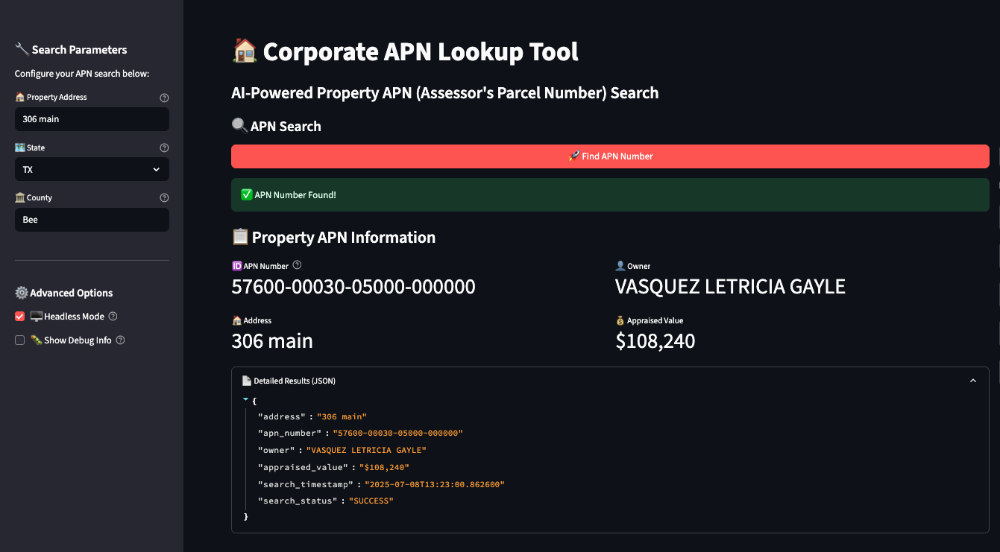
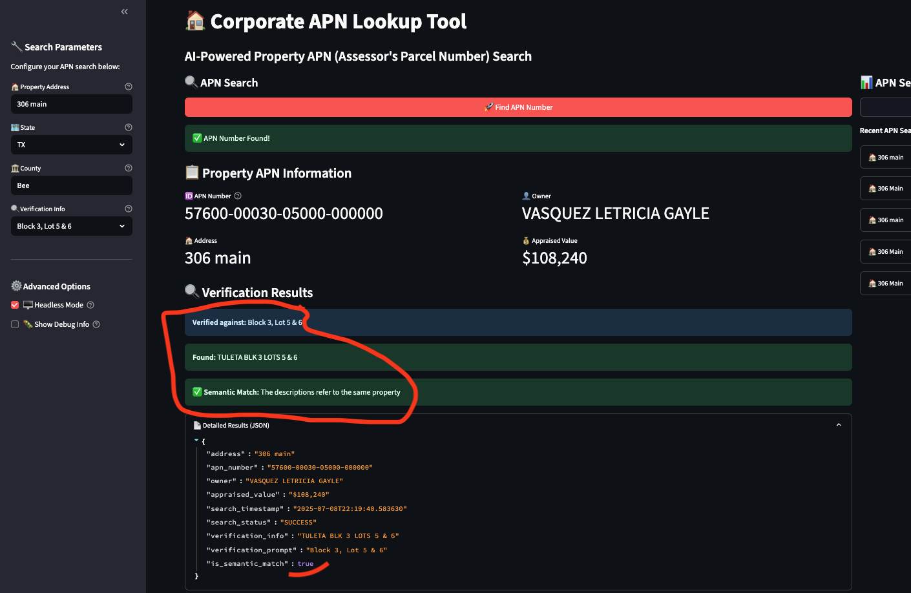

# Browser-Use Multi-Agent Workflow 🤖🔍

This project demonstrates the power of multi-agent AI workflows for property data retrieval and verification using browser automation.

## Multi-Agent Architecture

### Single Agent vs Multi-Agent Workflow
This project showcases two approaches to browser automation:

1. **Single Agent (app1_local.py)**: 
   - One AI agent performs the entire task
   - Searches for property by address
   - Extracts APN and basic property information
   - Simple but limited to one task per execution

2. **Multi-Agent Workflow (app4_local.py)**:
   - Primary agent searches for property and extracts APN
   - Secondary agent verifies property details against known information
   - Shared browser session between agents for efficiency
   - Enhanced data validation and verification

### Key Multi-Agent Features

- **Shared Browser Session**: Both agents operate in the same browser context
- **Sequential Task Execution**: First agent finds data, second agent verifies it
- **Specialized Roles**: Each agent has a focused task for better performance
- **Data Handoff**: Results from first agent inform the second agent's task
- **Verification Logic**: Second agent validates data against expected values

## Detailed Multi-Agent System Design

```
┌───────────────────────────────────────────────────────────────────────────────┐
│                          STREAMLIT USER INTERFACE                             │
│                                                                               │
│  ┌─────────────────────────┐                    ┌──────────────────────────┐  │
│  │   Input Parameters      │                    │    Results Display       │  │
│  │                         │                    │                          │  │
│  │ ┌─────────────────────┐ │                    │ ┌────────────────────┐   │  │
│  │ │ - Property Address  │ │                    │ │ - APN Number       │   │  │
│  │ │ - State             │ │                    │ │ - Property Owner   │   │  │
│  │ │ - County            │ │                    │ │ - Property Address │   │  │
│  │ │ - Verification Info │ │                    │ │ - Appraised Value │   │  │
│  │ └─────────────────────┘ │                    │ └────────────────────┘   │  │
│  └─────────────────────────┘                    │ ┌────────────────────┐   │  │
│                                                 │ │ Verification       │   │  │
│                                                 │ │ - Expected Info    │   │  │
│                                                 │ │ - Found Info       │   │  │
│                                                 │ │ - Semantic Match   │   │  │
│                                                 │ └────────────────────┘   │  │
│                                                 └──────────────────────────┘  │
└───────────────────────────────────────────────────────────────────────────────┘
                                      │
                                      ▼
┌───────────────────────────────────────────────────────────────────────────────┐
│                         MULTI-AGENT CONTROLLER                                │
│                                                                               │
│  ┌─────────────────────────────────────────────────────────────────────────┐  │
│  │                                                                         │  │
│  │  1. Initialize shared browser session                                   │  │
│  │  2. Configure Agent 1 with search task                                  │  │
│  │  3. Execute Agent 1 and collect results                                 │  │
│  │  4. Configure Agent 2 with verification task + Agent 1 results          │  │
│  │  5. Execute Agent 2 and collect verification results                    │  │
│  │  6. Close shared browser session                                        │  │
│  │  7. Return combined results to UI                                       │  │
│  │                                                                         │  │
│  └─────────────────────────────────────────────────────────────────────────┘  │
│                                                                               │
└───────────────────────────────────────────────────────────────────────────────┘
                │                                           │
                ▼                                           ▼
┌─────────────────────────────────┐         ┌─────────────────────────────────┐
│         AGENT 1: APN SEARCH     │         │     AGENT 2: VERIFICATION       │
│                                 │         │                                 │
│  ┌─────────────────────────┐    │         │  ┌─────────────────────────┐    │
│  │ Task Definition:        │    │         │  │ Task Definition:        │    │
│  │ - Navigate to county    │    │         │  │ - Access property page  │    │
│  │   property search       │    │         │  │   using APN from Agent 1 │    │
│  │ - Input address/location│    │         │  │ - Extract legal         │    │
│  │ - Submit search form    │    │         │  │   description           │    │
│  │ - Extract APN number    │    │         │  │ - Compare with expected │    │
│  │ - Extract basic property│    │         │  │   verification info     │    │
│  │   details              │    │         │  │ - Perform semantic      │    │
│  │                         │    │         │  │   matching              │    │
│  └─────────────────────────┘    │         │  └─────────────────────────┘    │
│                                 │         │                                 │
└─────────────────────────────────┘         └─────────────────────────────────┘
                │                                           │
                └───────────────┬───────────────────────────┘
                                ▼
┌───────────────────────────────────────────────────────────────────────────────┐
│                         SHARED BROWSER SESSION                                │
│                                                                               │
│  ┌─────────────────────────────────────────────────────────────────────────┐  │
│  │                                                                         │  │
│  │  - Chromium browser instance                                           │  │
│  │  - Persistent user profile                                             │  │
│  │  - Shared cookies and session state                                    │  │
│  │  - Visual processing capabilities                                       │  │
│  │  - DOM interaction methods                                             │  │
│  │                                                                         │  │
│  └─────────────────────────────────────────────────────────────────────────┘  │
│                                                                               │
└───────────────────────────────────────────────────────────────────────────────┘
                                      │
                                      ▼
┌───────────────────────────────────────────────────────────────────────────────┐
│                              LLM INTEGRATION                                  │
│                                                                               │
│  ┌─────────────────────────────────────────────────────────────────────────┐  │
│  │                                                                         │  │
│  │  - GPT-4o model for both agents                                        │  │
│  │  - Vision capabilities for screenshot analysis                          │  │
│  │  - Task planning and execution                                          │  │
│  │  - Natural language understanding of property descriptions              │  │
│  │  - Semantic matching for verification                                   │  │
│  │                                                                         │  │
│  └─────────────────────────────────────────────────────────────────────────┘  │
│                                                                               │
└───────────────────────────────────────────────────────────────────────────────┘
```

## Application Screenshots

### Basic Single-Agent Workflow (app1_local.py)

*Screenshot of streamlit app after successful execution of app1_local.py - Single agent retrieves APN only*

### Advanced Multi-Agent Workflow (app4_local.py)

*Screenshot of streamlit app after successful execution of app4_local.py - Two agents work together to retrieve and verify property data*

## Technical Implementation

### Multi-Agent Browser Session Management
```python
# Create a shared browser session
shared_session = BrowserSession(
    browser_type="chromium",
    user_data_dir=f"~/.config/browseruse/profiles/{unique_profile}",
    keep_alive=True,  # Keep browser open between agents
    headless=headless
)
await shared_session.start()  # Start session manually

# Agent 1: Find APN
agent1 = Agent(
    task=apn_search_task,
    llm=self.llm,
    browser_session=shared_session,  # Use shared session
    use_vision=True
)
apn_result = await agent1.run()

# Agent 2: Verify information
agent2 = Agent(
    task=verification_task,
    llm=self.llm,
    browser_session=shared_session,  # Reuse the same session
    use_vision=True
)
verification_result = await agent2.run()

# Close the shared session when done
await shared_session.close()
```

### Agent Task Specialization
Each agent has a specialized task:

1. **APN Search Agent**:
   - Navigates to county property records
   - Searches by address
   - Extracts APN and property details

2. **Verification Agent**:
   - Examines legal description and property details
   - Matches against expected information
   - Confirms property identity

## Environment Setup

- 📁 **Virtual Environment**: `venv_browser/` with Python 3.11.7
- 🔑 **API Keys**: Configured in `.env` file (OpenAI ready)
- 🌐 **Browser**: Chromium installed and ready
- 🤖 **LLM**: GPT-4o for both agents

## Installation Steps

### 1. Install Python 3.11 (Required)
```bash
# Install pyenv for Python version management
curl https://pyenv.run | bash

# Add pyenv to your shell
export PYENV_ROOT="$HOME/.pyenv"
[[ -d $PYENV_ROOT/bin ]] && export PATH="$PYENV_ROOT/bin:$PATH"
eval "$(pyenv init - bash)"
eval "$(pyenv virtualenv-init -)"

# Install Python 3.11.7
pyenv install 3.11.7

# Set local Python version
pyenv local 3.11.7
```

### 2. Create and Activate Virtual Environment
```bash
# Create virtual environment with Python 3.11.7
python -m venv venv_browser

# Activate the environment
source venv_browser/bin/activate
```

### 3. Install Dependencies
```bash
# Install packages from requirements.txt
pip install -r requirements.txt

# Install Chromium browser for Playwright
playwright install chromium --with-deps
```

### 4. Run the Applications
```bash
# Run the single-agent app
source venv_browser/bin/activate && streamlit run app1_local.py

# Run the multi-agent app
source venv_browser/bin/activate && streamlit run app4_local.py
```

## API Keys Setup

Add your API keys to `.env`:
```bash
# Required for both agents
OPENAI_API_KEY=your_key_here
```

## Resources
- 📖 [browser-use Documentation](https://docs.browser-use.com/)
- 🐙 [GitHub Repository](https://github.com/browser-use/browser-use)
- ☁️ [Cloud Version](https://browser-use.com/)

---
**Status**: ✅ Ready to use! Your multi-agent browser automation workflow is fully configured.
